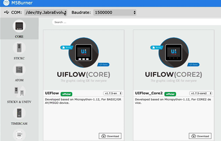
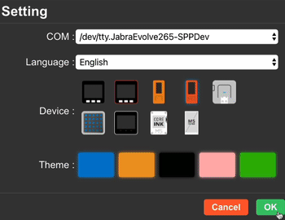
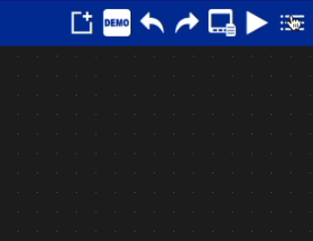
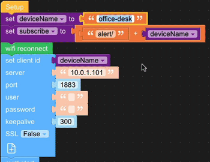
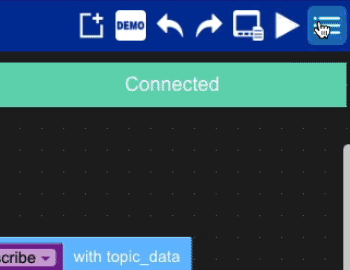
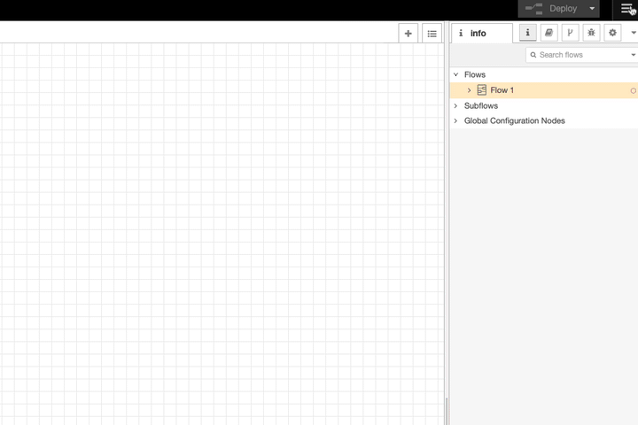
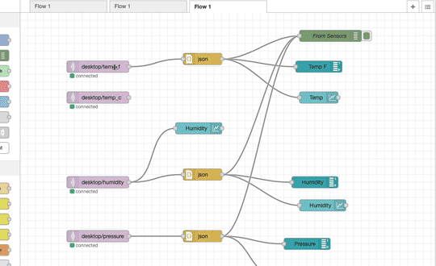

# Install and Configure M5Stick

In this lab, we are going to install and configure the Environment Sensor to push it's data to out local Kubernetes  cluster

## Before start the lab you need to install and configure the software to manage the M5Stick Sensors. Open a Browser and go the the URL located below. Download the proper version of software for your OS

#### Prerequisite
  - Kubernetes 
  - MQTT Server deployed
    - IP address of MQTT Service
  - Node Red Deployed


# Download and install M5 Software on your Desktop

### 1) Download the following files from https://shop.m5stack.com/pages/download

```
  - UIFlow-Desktop-UI
  - M5Burner
  - CP2104 Driver (or proper driver for your OS)
```

### 2) Install UIFlow, M5Burner App and CP2104 Driver

  *  Reboot may be need to USB driver

# Update Firmware on M5Stack with M5Burner

### 1) Launch the M5Burner App 
```
  - Select the COM Driver and the Speed
  - Select the Orange STICKC
  - Select the Latest Rom for UIFLOW(StickC Plus)
```



# Install env2_mqtt.m5f on M5Stick

### 2) Launch UI-Flow 
```
  - Select the COM
  - Select the Latest Rom for UIFLOW(StickC Plus)
  - Select the Orange STICKC
```




### 3) Open env2_mqtt.m5f 



### 4) Customize ev2_mqtt
```
  - deviceName - [Your Device Name]
  - server - [MQTT Service IP Address]
```



### 4) Download to 5Stick




# Deploy NodeRed noderred-mqtt-env-dashboard-flows

### 1) In a browser, Go to you NodeRed  you nodered console [10.0.9.102:1880]

### 2) Open the Hamberger menu -> Manage palatte -> Install




### 3) Install the foloowing pallets

  - node-red-dashboard
  - node-red-contrib-ui-level

### 4) Import mqtt-nodered-temp-dashboard-flows.flow into node red

### 5) Update your MQTT Server




### 6) Deploy

### 5) Access the Dashboard from a browserttp://10.0.9.102:1880/ui/