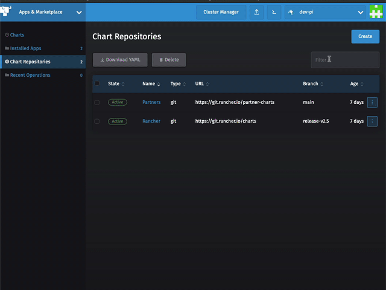

# Lesson Edge - Deploy MQTT for the sensors to talk to

In this lab we are going to install and configure an MQTT Workload to run on k3s or RKE cluster

There are 2 methods provided to install MQTT, the Easy Method with Rancher and Helm, or the Manual Method which include the needed yaml files. 


## Easy Method via Rancher and Helm

### Add k8s-at-home Repo

    Select App & Marketplace -> Chart Repositories


Click Create to define a new Chart Repository
    
    Name: k8s-at-home
    Index url: https://k8s-at-home.com/charts/
    


    You should now see the k8s-at-home Repo


### Install Mosquitto 


    Select Chart 
    
    You should now see the option to install Mosquitto
    
Give it a name 


Click on Values YAML and change the following items
    
    service:
      type: LoadBalancer


    Press Install and watch it deploy


## Manual Method 

### Deploy MQTT using the local-path-provisioner 

For x86

    kubectl create -f nodered-deployment.yaml
For Raspberry Pi

    kubectl create -f nodered-Raspberry-Pi-deployment.yaml
### Deploy the Service

    kubectl create -f nodered-service-lb.yaml


### Locate IP address of Node-Red

    kubectl get svc -n nodered

Example:

```
NAME      TYPE           CLUSTER-IP      EXTERNAL-IP   PORT(S)        AGE
mqtt   LoadBalancer   10.43.233.129   10.0.11.102   80:31063/TCP   8m33s
```

This example tells us that Node-Red is now available on 10.0.11.102 on port 1883
