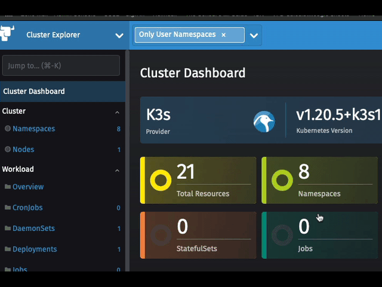
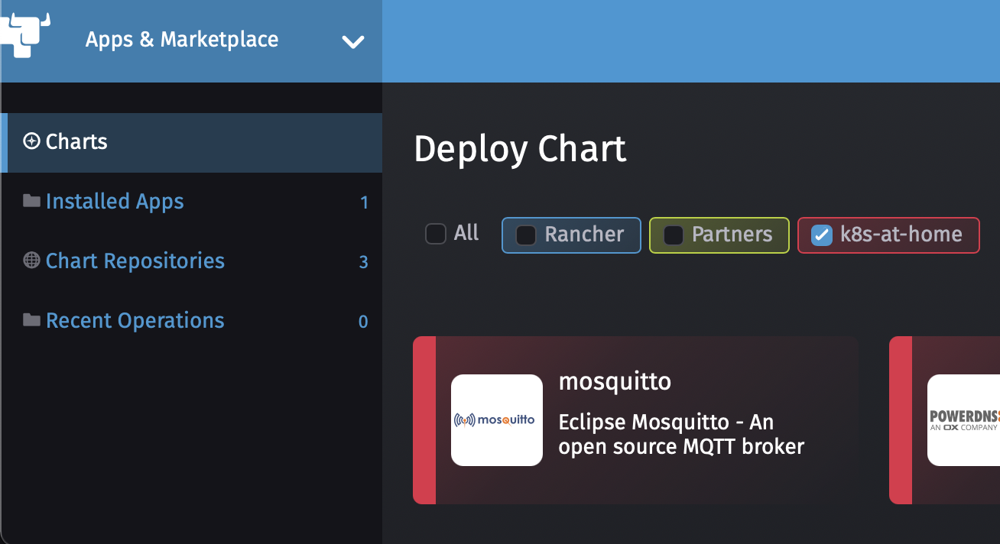
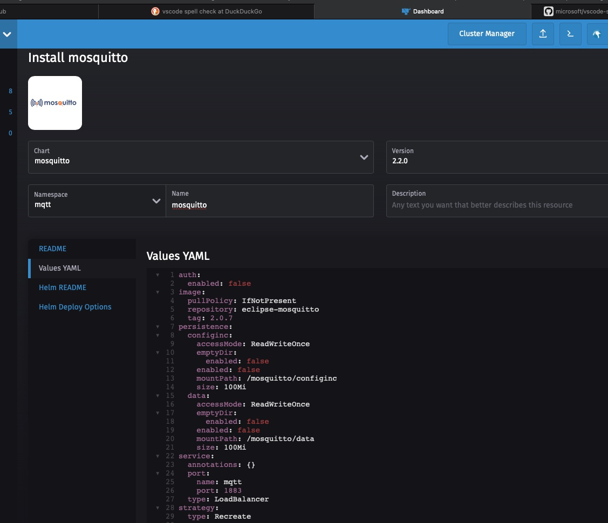
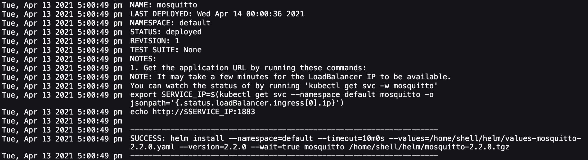

# Lesson Edge - Deploy MQTT for the sensors to talk to

In this lab we are going to install and configure an MQTT Workload to run on k3s or RKE cluster

There are 2 methods provided to install MQTT, the Easy Method with Rancher and Helm, or the Manual Method which include the needed yaml files. 

### Prerequisites:

     Rancher
     Kubernetes Cluster
        Default StorageClass
        LoadBalancer

# Easy Method via Rancher and Helm

### 1) Add k8s-at-home Repo

    Select App & Marketplace -> Chart Repositories

### 2) Click Create to define a new Chart Repository
    
    Name: k8s-at-home
    Index url: https://k8s-at-home.com/charts/
    

### You should now see the k8s-at-home Repo

### 3) Select Charts - You should now see Mosquitto as an available Chart

### 4) Install Mosquitto 

Click on Values YAML and change the following items
    
    service:
      type: LoadBalancer

### 5) Press Install and watch it deploy

# Manual Method 

### 1) Deploy Mosquitto using the local-path-provisioner 

For x86

    kubectl create -f mosquitto-deployment.yaml
For Raspberry Pi

    kubectl create -f mosquitto-Raspberry-Pi-deployment.yaml
    
### 2) Deploy the Service

    kubectl create -f mosquitto-service.yaml

### 3) Locate IP address of Mosquitto

    kubectl get svc  mosquitto

Example:

    NAME        TYPE           CLUSTER-IP      EXTERNAL-IP   PORT(S)          AGE
    mosquitto   LoadBalancer   10.43.175.123   10.0.9.102    1883:30690/TCP   87s

This example tells us that Mosquitto is now available on 10.0.9.102 on port 1883
