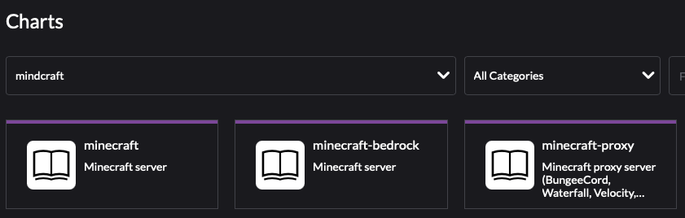

## Install Minecraft 

In this lab we are going to install and configure  Minecraft with the option to load custom worlds/maps. 


### Prerequisites:

We are assuming you are running the Equivalent to the SUSE at Home Base which includes the following:

     * Rancher 2.5+ or 2.6+
     * Kubernetes Cluster
        LoadBalancer - Metallb

      * Persistent Storage 
         Storage Class defined and set as Default Storage Class

# What Version do I want to install?

There are 2 versions of the Minecraft server, Java and Bedrock

Java is the original version and has the most mods, skins and worlds but it only supports Computer based (Java) clients (No consoles). It also has a large variety of options you can tweak (I,E, Hardcore Survival mode) when you launch the server.

Bedrock is was written by Microsoft in 2017 from the ground up. It supports modern console (unlike the Java version). It currently has less mods and worlds but this is quickly changing. It has less options to customize your World on Launch

For additional information check out the link below:

https://www.thegamer.com/minecraft-bedrock-vs-java-comparison/


# Install Minecraft Java Edition

### 1) Define a namespace for you Application if you have not already done so

### 2) Add Minecraft Repo

    Select App & Marketplace -> Chart Repositories


### 3) Click Create to define a new Chart Repository
    
    Name: minecraft
    Index url: https://itzg.github.io/minecraft-server-charts/
    


You should now see the Minecraft Repo


### 4) Select Charts - You should now see Minecraft as an available Chart




### 5) Config and Deploy Minecraft 


Click on Install in the upper right to start the install

Click on Values YAML and change/add at a Minimum, change the following items


``` 
minecraftServer:
    eula: 'TRUE'
    motd: Welcome to Minecraft on Kubernetes!
  rcon:
    enabled: true
    password: CHANGEME!
    serviceType: LoadBalancer
  serviceType: LoadBalancer

persistence:
  annotations: {}
  dataDir:
    Size: 1Gi
    enabled: true

resources:
  requests:
    cpu: 1000m
    memory: 1024Mi

        
```
      


### 6) Press Install and watch it deploy


### 7) Locate the Minecraft Service

    Cluster Explorer -> Services


## Add a custom World

Custom Worlds are stored as zip files and need to be easily downloaded by the pod on launch (I.E. http://server.xyz.com/MyCoolWorld.zip)


### 1) Find a World you want to install and keep it in it's original zip format

    Checkout http://www.planetminecraft.com

         *Make sure you download only Java versions

### 2) Save the zip to location that the pod can easily download from
    http://server.xyz.com/MyCoolWorld.zip

### 3) Follow the steps above to install the Java edition
When editing the Values.yaml (Step 5) add the following value

    sa

### 4) when editing the 
 
# Install Minecraft Bedrock Edition

### 1) Define a namespace for you Application if you have not already done so

### 2) Add Minecraft Repo

    Select App & Marketplace -> Chart Repositories


### 3) Click Create to define a new Chart Repository
    
    Name: minecraft
    Index url: https://itzg.github.io/minecraft-server-charts/
    


You should now see the Minecraft Repo


### 4) Select Charts - You should now see Minecraft as an available Chart


### 5) Config and Deploy Minecraft 


Click on Install in the upper right to start the install

Click on Values YAML and change/add at a Minimum, change the following items


``` 
minecraftServer:
    eula: 'TRUE'
    motd: Welcome to Minecraft on Kubernetes!
  rcon:
    enabled: true
    password: CHANGEME!
    serviceType: LoadBalancer
  serviceType: LoadBalancer

persistence:
  annotations: {}
  dataDir:
    Size: 1Gi
    enabled: true

resources:
  requests:
    cpu: 1000m
    memory: 1024Mi

        
```
      


### 6) Press Install and watch it deploy


### 7) Locate the Minecraft Service

    Cluster Explorer -> Services

