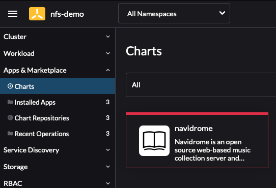
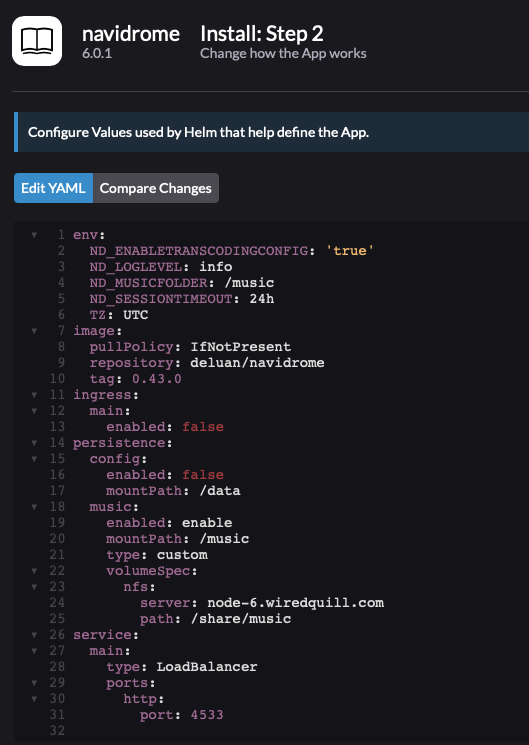
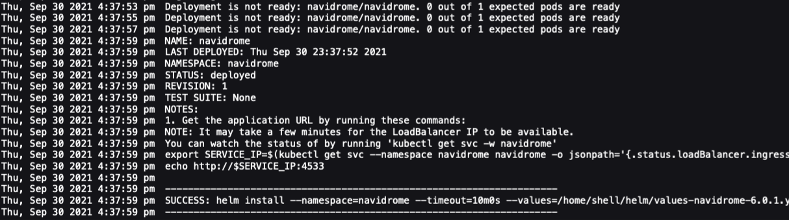
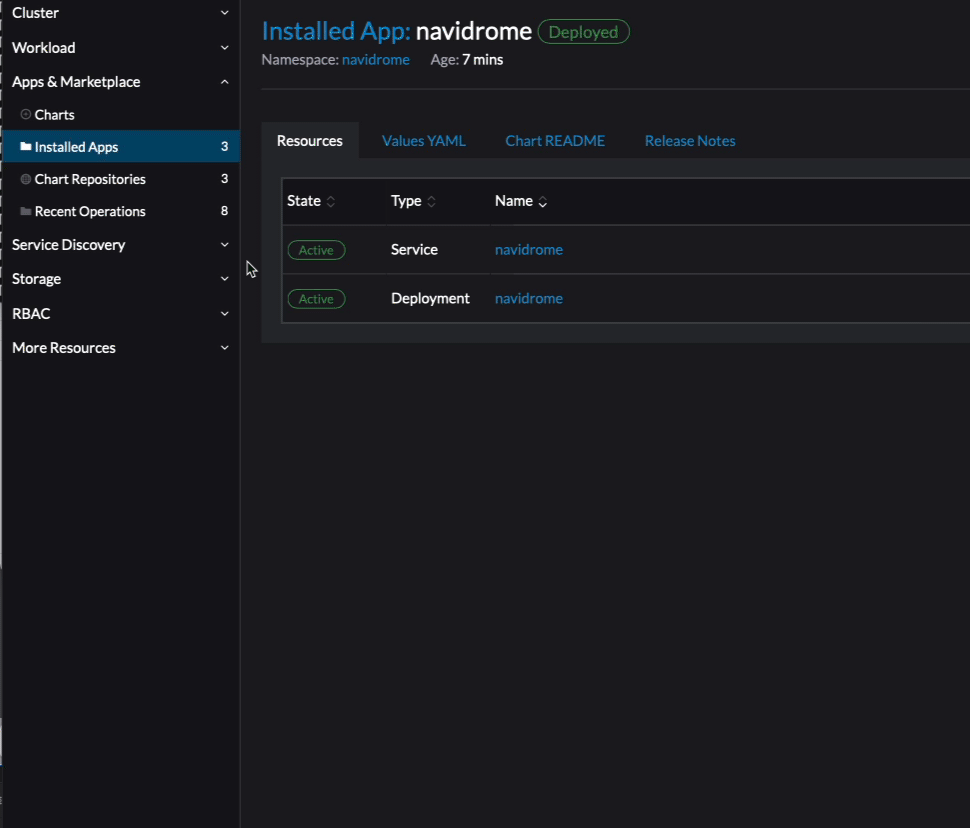

## Install Navidrome with an nfs mount to your music collection

In this lab we are going to install and configure Naidrome Media Streamer. 

We will configure nfs to mount your music collection /music within the pod

Optionally you can configure the database to be stored on nfs via the NFS Provisioner

### Prerequisites:

     * Rancher
     * Kubernetes Cluster
        NFS Provisioner (optional)
        LoadBalancer - Metallb (Optional)

      * NFS Server
         Folder for Music
         Folder for Database (Optional)

      * NFS Client install on all Kubernetes Nodes
            *test nfs mount on ever node

# Install Naivdrome

### 1) Add k8s-at-home Repo (if not already defined)

    Select App & Marketplace -> Chart Repositories


### 2) Click Create to define a new Chart Repository
    
    Name: k8s-at-home
    Index url: https://k8s-at-home.com/charts/
    


You should now see the k8s-at-home Repo


### 3) Select Charts - You should now see Navidrome as an available Chart




### 4) Install Navidrome 


Click on Values YAML and change/add the following items

``` 
persistence:
  config:
    enabled: false
    mountPath: /data
  music:
    enabled: enable
    mountPath: /music
    type: custom
    volumeSpec:
      nfs:
        server: node-6.wiredquill.com
        path: /share/music 
    
service:
  main:
  type: LoadBalancer
    ports:
      http:
        port: 4533
        
```
      




### 5) Press Install and watch it deploy



### 6) Locate the Navidrome Service

    Cluster Explorer -> Services



# Install Naivdrome with NFS PVC

### 1) Check to verify you have a pvc is the namespace you are planning on deploying in

```
kubectle get pvc -A
```

Example
```
NAMESPACE   NAME       STATUS   VOLUME                                     CAPACITY   ACCESS MODES   STORAGECLASS   AGE
default     nfsclaim   Bound    pvc-22295e73-9a25-4b5c-9546-3ec43ba1e23c   10Mi       RWO            nfs            95m
```


### 2) Install Navidrome w/ a pvc Enabled


Click on Values YAML and change/add the following items

``` 

persistence:
  config:
    enabled: enable
    mountPath: /data
    type: pvc
    existingClaim: nfsclaim
  music:
    enabled: enable
    mountPath: /music
    type: custom
    volumeSpec:
      nfs:
        server: node-6.wiredquill.com
        path: /share/music 
    
service:
  main:
  type: LoadBalancer
    ports:
      http:
        port: 4533
        
```