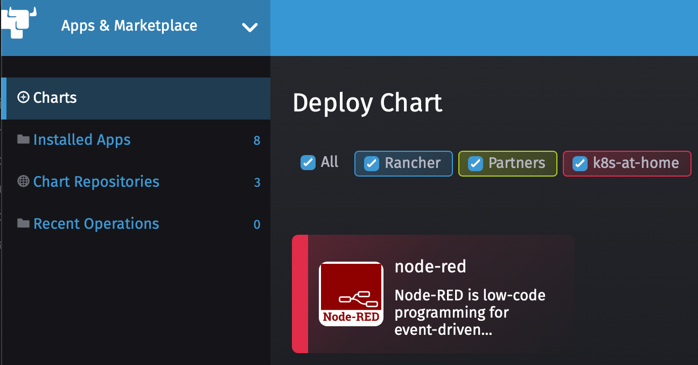
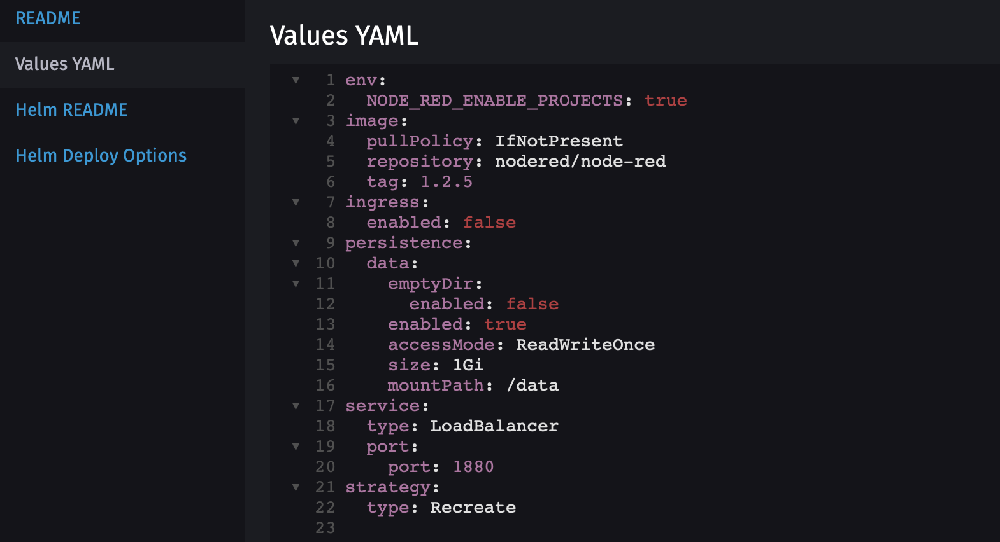
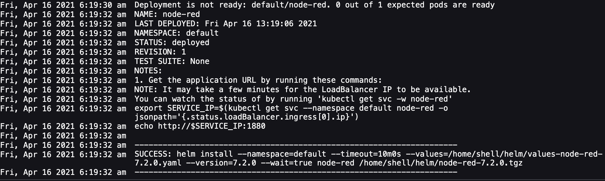
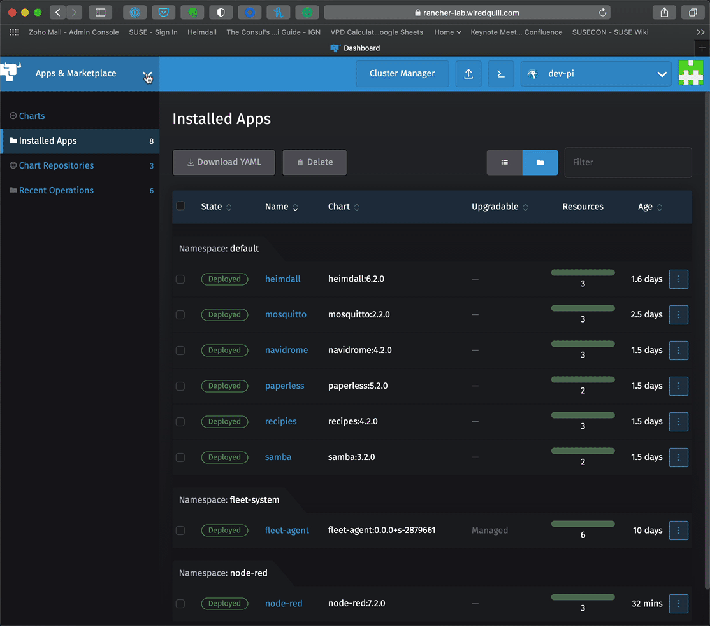

## Configuring Node Red with Storage

In this lab we are going to install and configure Node-Red using the Local Storage Provider for Storage Workload to run on k3s or RKE cluster

There are 2 methods provided to install Node-Red, the Easy Method with Rancher and Helm, or the Manual Method which include the needed yaml files. 

### Prerequisites:

     Rancher
     Kubernetes Cluster
        Default StorageClass
        LoadBalancer

# Easy Method via Rancher and Helm

### 1) Add k8s-at-home Repo (if not already defined)

    Select App & Marketplace -> Chart Repositories


### 2) Click Create to define a new Chart Repository
    
    Name: k8s-at-home
    Index url: https://k8s-at-home.com/charts/
    


You should now see the k8s-at-home Repo


### 3) Select Charts - You should now see Node-Red as an available Chart




### 4) Install Node-Red 


Click on Values YAML and change/add the following items
 
    env:
      NODE_RED_ENABLE_PROJECTS: true

    persistence:
      data:      
       enabled: true
       accessMode: ReadWriteOnce
       size: 1Gi
    
    service:
      type: LoadBalancer




### 5) Press Install and watch it deploy



### 6) Locate the Node-Red Service

    Cluster Explorer -> Services



# Manual Method 

### 1) Deploy Node-Red using the local-path-provisioner 


### Deploy Node-Red using the local-path-provisioner on K3s & create a service to expose the deployment

    kubectl create -f nodered-deployment.yaml
    kubectl create -f nodered-service-lb.yaml


### Locate IP address of Node-Red

    kubectl get svc -n nodered

Example:

```
NAME      TYPE           CLUSTER-IP      EXTERNAL-IP   PORT(S)        AGE
nodered   LoadBalancer   10.43.233.129   10.0.11.102   80:31063/TCP   8m33s
```

This example tells us that Node-Red is now available on 10.0.11.102 on port 80
