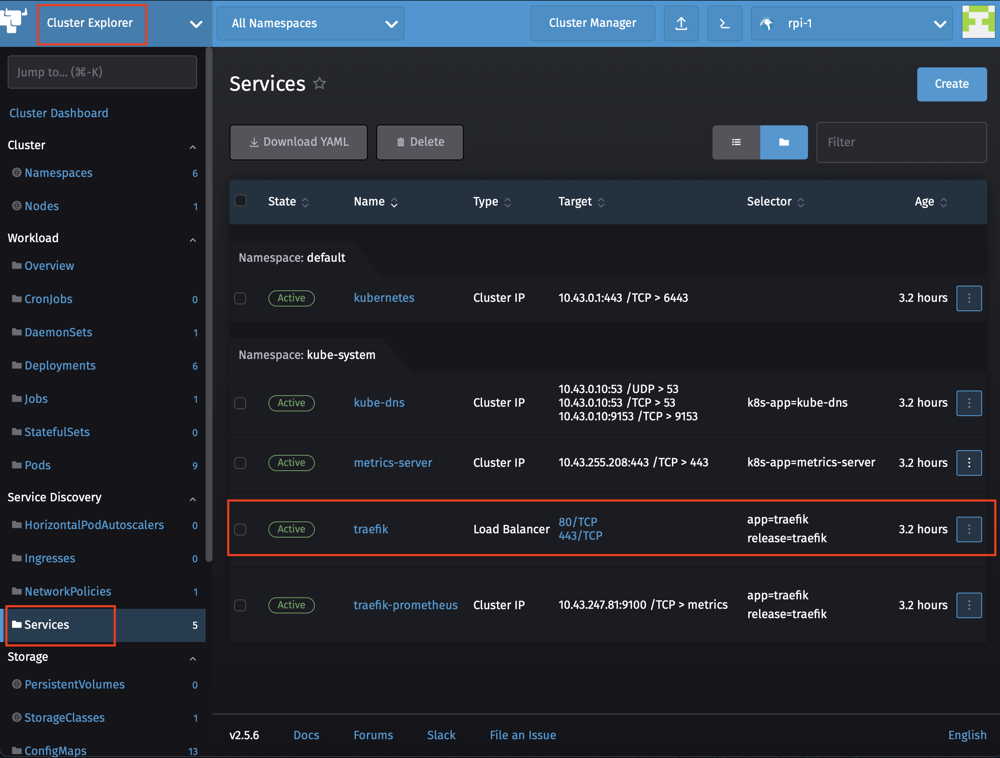
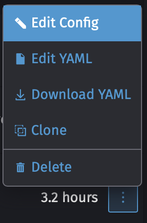
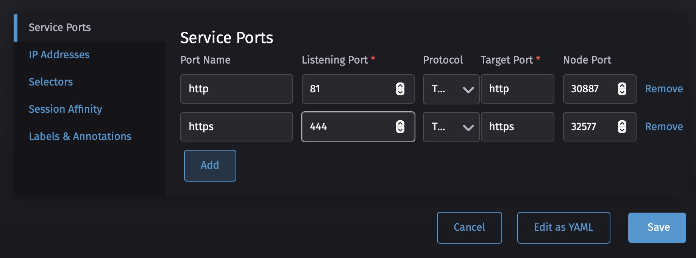
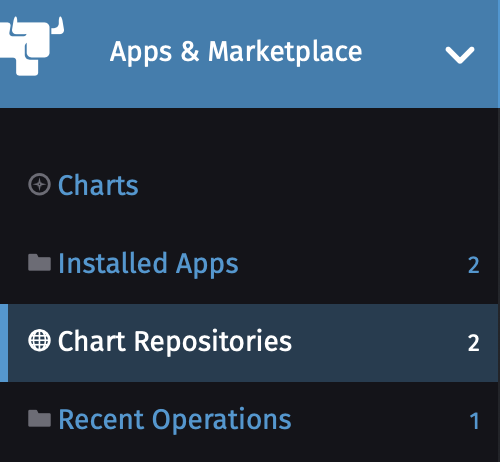
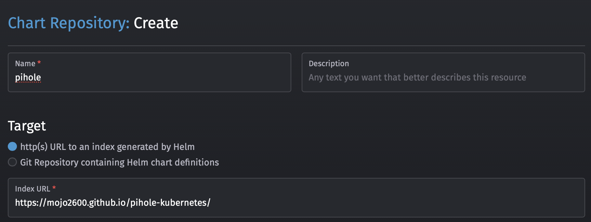
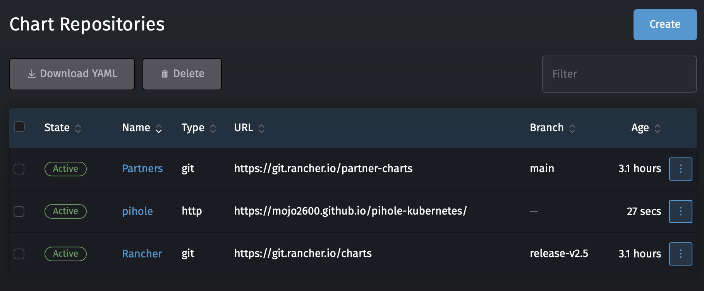
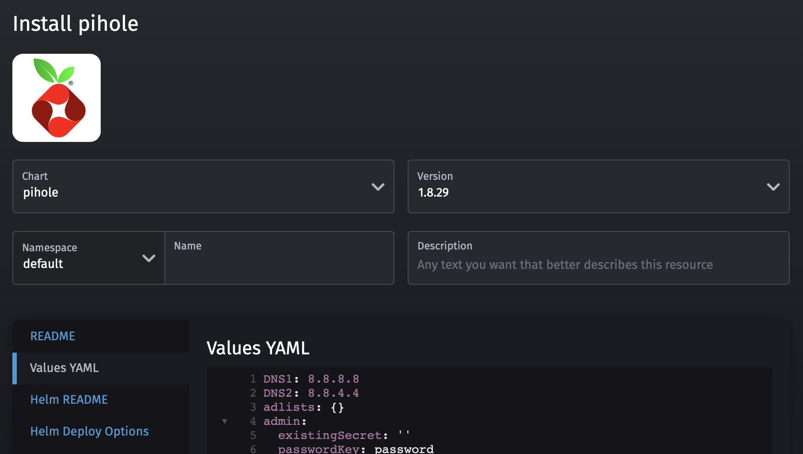
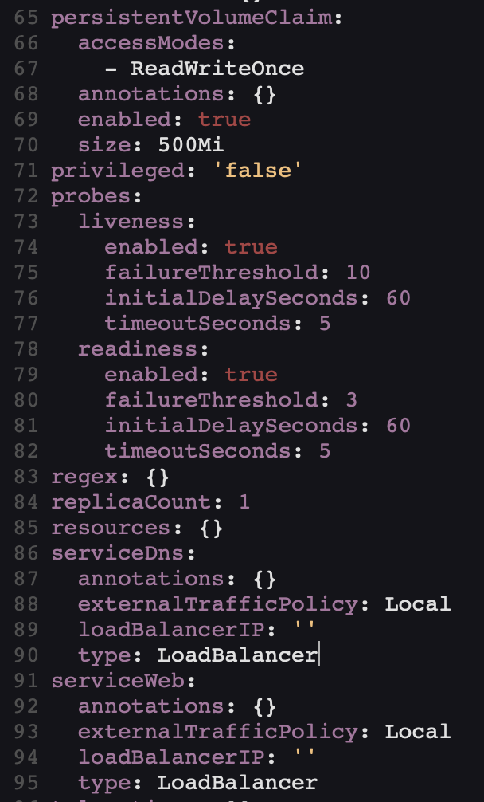
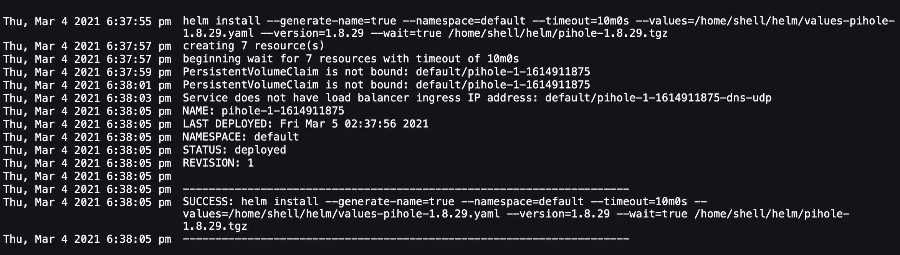
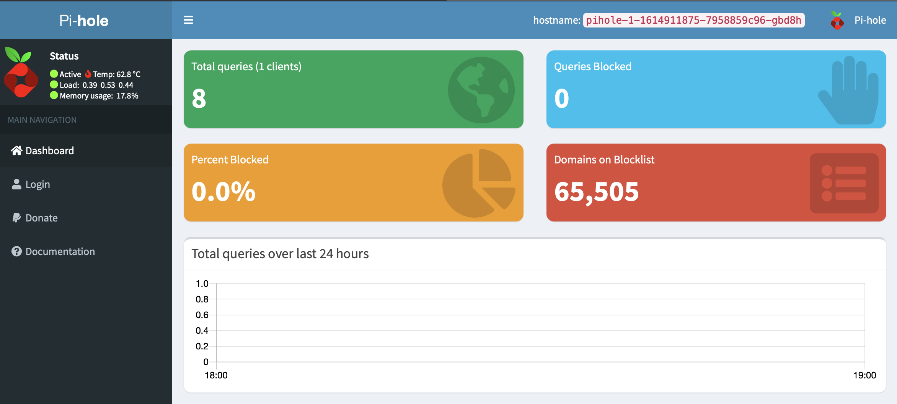

## Installing k3s

In this lab, we are going to import and existing Kubernetes Cluster into Rancher. 
The same steps will work for an RKE, K3s or any other Kubernetes distro

## Prerequisites:
 - running Rancher Server
 - K3s installed on a Raspberry Pi Managed by Rancher

## Step by Step Instructions

### Change the ports Traefik is ussing to 81 and 444

    Select Cluster Explorer -> Services

    Edit the Traefik Service 
    

    Change to ports 81 and 444 and Press Save

    You should see the Service Change

### Add Pi-hole Repo

    Select App & Marketplace -> Chart Repositories

    Click Create to define a new Chart Repository
    
    Name: Pihole
    Index url: https://mojo2600.github.io/pihole-kubernetes/
    

    You should see now see the Pi-hole Repo

    Select Chart 
    
    You should now see the option to install pihole
    
    Give it a name 

    Click on Values YAML and change the following items
    
    persistentVolumeClaim:
      enabled: true
    serviceDns:
      type: LoadBalancer
    serviceWeb:
      type: LoadBalancer
    
    

    Press Install and watch it deploy

    Wait a couple of mins for it to deploy then open a browser to http://[Raspberry-Pi-IP]/admin/ 

    To take advantage of Pi-Hole change your workstation to use your Raspberry Pi's IP address as the DNS Servers
    
### Testing Pi-hole

    Open a Browser to https://fuzzthepiguy.tech/adtest/ and see you you see ads.
