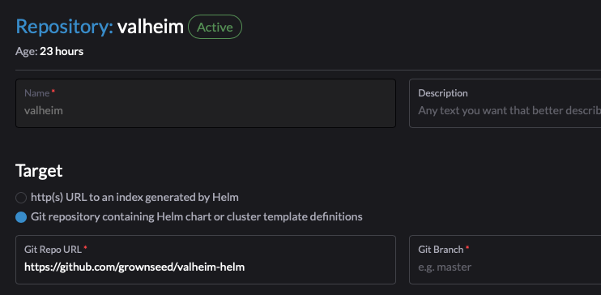
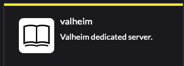
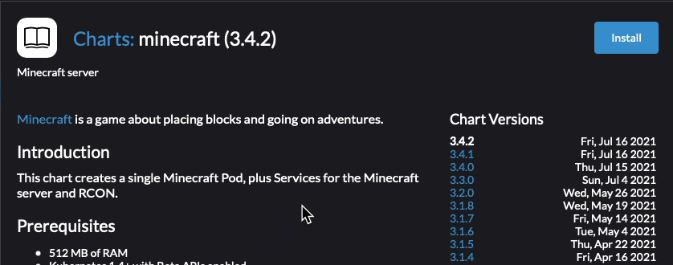
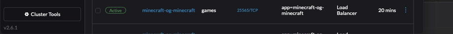

## Install Valheim 

In this lab we are going to install and configure  Valheim. 

### Prerequisites:

We are assuming you are running the Equivalent to the SUSE at Home Base which includes the following:

     * Rancher 2.5+ or 2.6+
     * Kubernetes Cluster (k3s)
        LoadBalancer - Metallb

      * Persistent Storage 
         Storage Class defined and set as Default Storage Class

# Install Valheim 

### 1) Define a namespace for you Application if you have not already done so

### 2) Add Valheim Repo

    Select App & Marketplace -> Chart Repositories

### 3) Click Create to define a new Chart Repository
    
    Name: Valheim
    Index url: https://github.com/Addyvan/valheim-k8s
    

You should now see the Valheim Repo

### 4) Select Charts - You should now see Valheim as an available Chart

### 5) Config and Deploy Valheim 

Click on Install in the upper right to start the install

### 6) Press Install and watch the Deployment run

### 7) Watch the Valheim Pod's log 

### 7) Locate the Valheim Service

    Cluster Explorer -> Services

