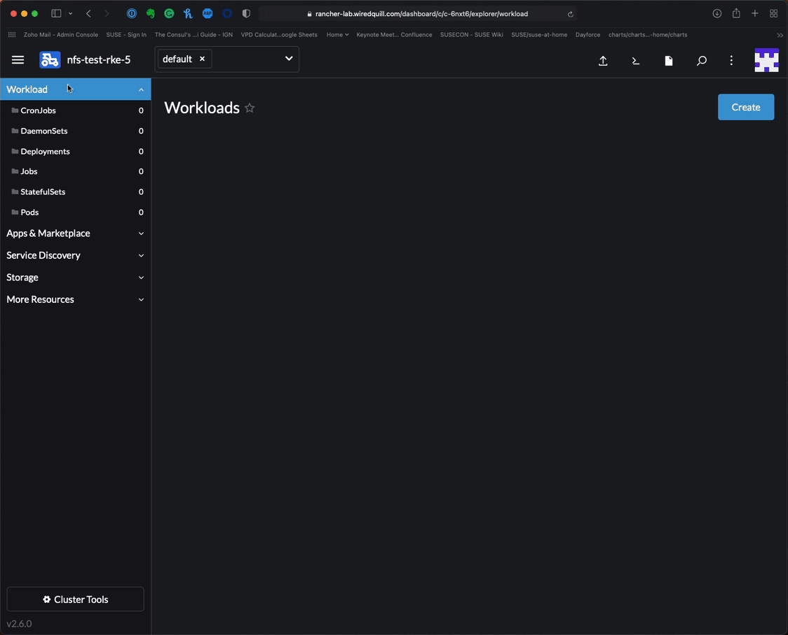
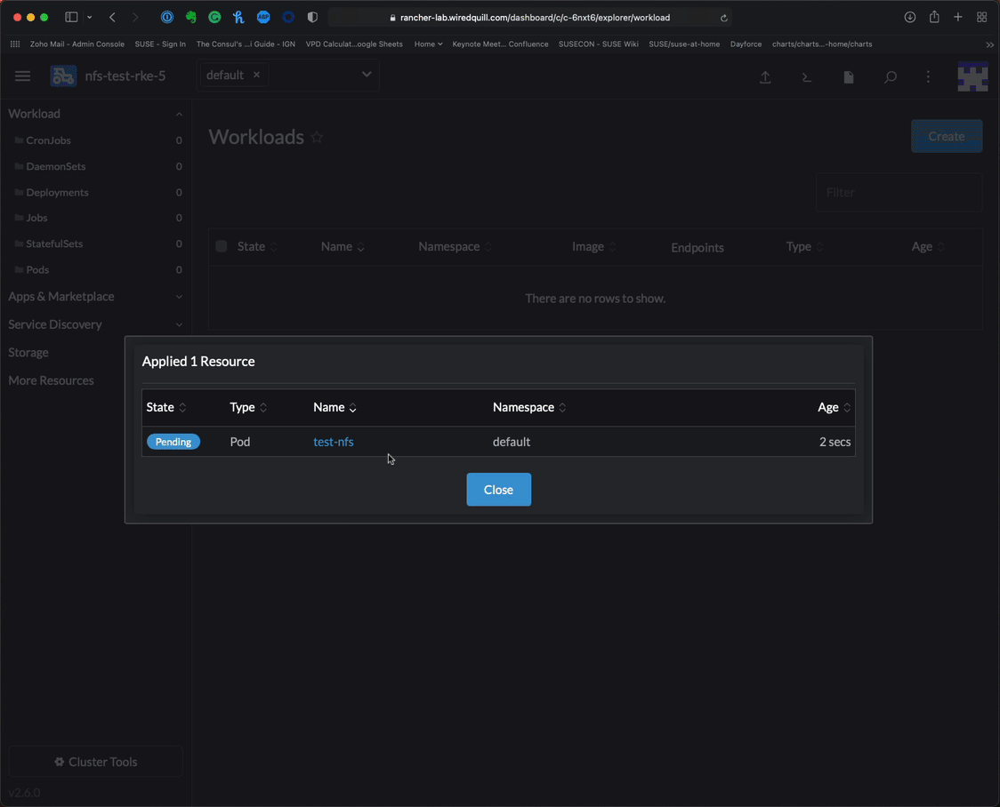

## Deploying a test NFS pod

In this lab, we are going to deploy a pod to verify that 

## Prerequisites:
 - Running Kubernetes Node with NFS client installed
 - The ability to run kubectl commands
 - NFS server w/ a share
 - *Manualy test NFS from each node or your or the deployment will fail

# From a Terminal (Option 1)

### 1) Deploy nfs-mount-test.yaml 

```
kubectl apply -f nfs-mount-test.yaml
```

### 2) Verifiy nfs-verified was created on your NFS server

From the NFS Server

```
ls /share
```

Example
```
nfs-verified
```

# From Rancher UI (Option 2)

### 1) Import nfs-mount-test.yaml and customize the server settings to match your NFS Server



### 2) View the Pod via the Rancher Interface



