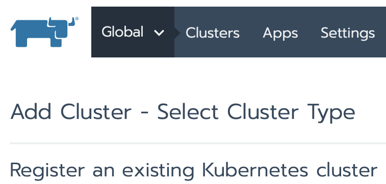
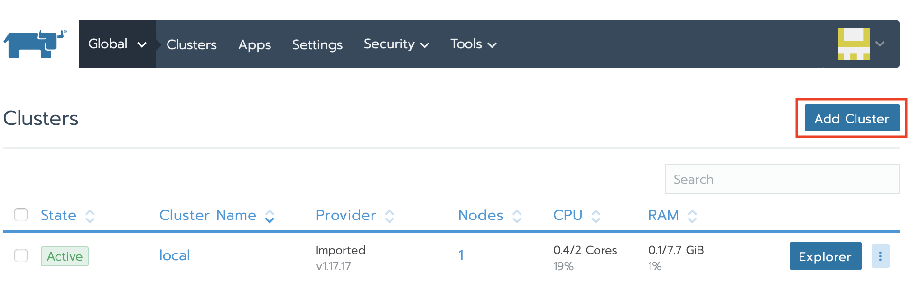
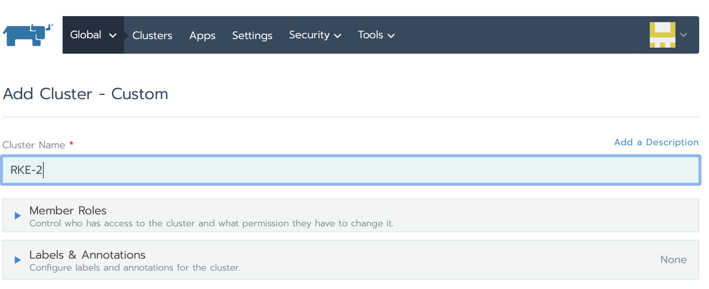
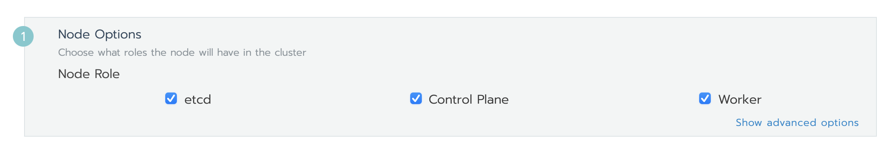
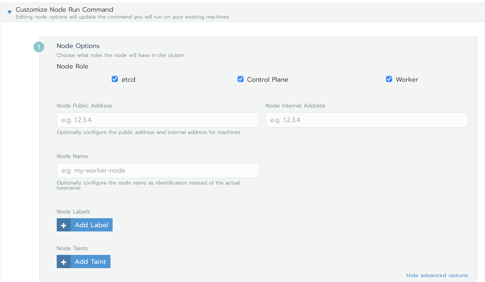
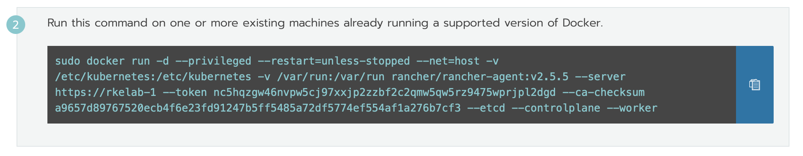

# Installing RKE on SLES from Rancher

At the end of the Lab you will have an RKE instance running on SLES 15 SP2

### Prerequisites:

- SLES 15 SP2 Server
- Docker installed
- Tux user
- SSH Keys copied between Rancher Server and SLES 15 SP2 server

## Installation on RKE on SLES 15 SP2
#### Step by Step Instructions

1) Hover over the top left dropdown, then click Global



2)Click Add Cluster
        * The current context is shown in the upper left, and should say 'Global'
        * Note the multiple types of Kubernetes cluster Rancher supports. We will be using Custom for this lab, but there are a lot of possibilities with Rancher.


    Click on the From existing nodes (Custom) Cluster box


    Enter a name in the Cluster Name box


    Click Next at the bottom.

    Make sure the boxes etcd, Control Plane, and Worker are all ticked.


    Click Show advanced options to the bottom right of the Worker checkbox

Enter the Public Address and if on cloud add the Internal Address
        * IMPORTANT: It is VERY important that you use the correct External and Internal addresses from the for this step,  and run it on the correct machine. Failure to do this will cause the future steps to fail.



    Click the clipboard to Copy to Clipboard the docker run command


```
Paste the Docker command into the Terminal Session on the SLES 15 SP2 instance you want to become an RKE Host
```    


```
View Progress from Rancher 
```
