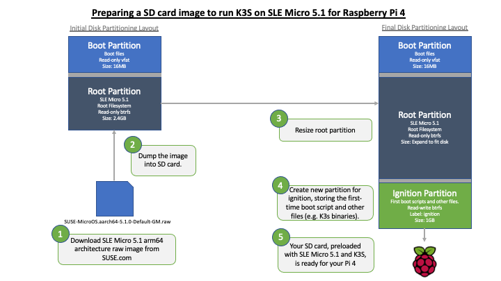
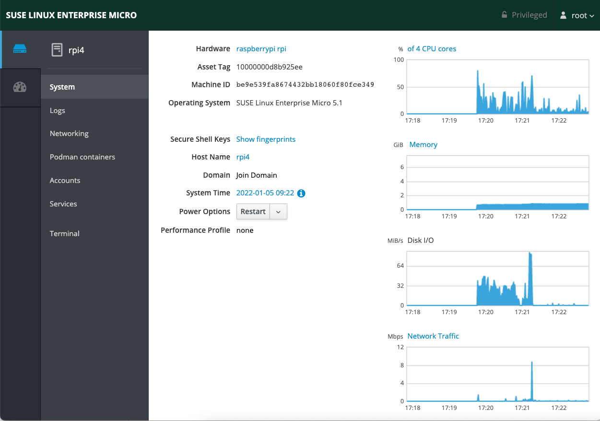
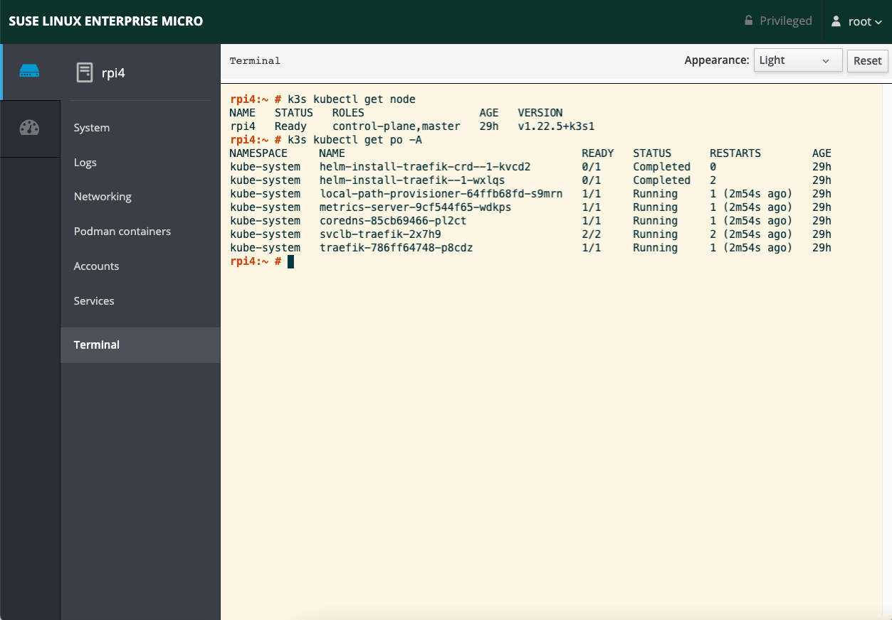
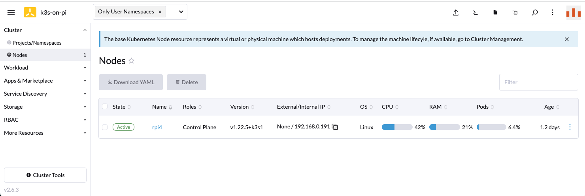

# Airgap installation of K3S and SLE Micro 5.1 on Raspberry Pi 4


## Introduction

* In this article, we will show you how to use an raw image approach to deploy SLE Micro 5.1 onto Raspberry Pi 4. 
* We will also show you how to preload K3S into this image so that you can run K3S without internet access on the Pi.


## What do you need?

* Linux workstation - to prepare a bootable OS with K3S images preloaded in a given SD card. The steps provided here has been tested with SLES 15 SP3, but it should work for other Linux distros. Internet access is required during the image disk preparation. 
* USB Card Reader - to read and write images to the SD Card from the Linux workstation.
* microSD Card - minimum 8GB is recommended.
* Raspberry Pi 4 - to be booted from the SD card.


## Steps



Please note that all the commands given are to be run as root privileged unless it's specified.

### 1. Download SLE Micro 5.1

Register and get a 60 day free trial SLE Micro 5.1 evaluation copy from SUSE.com website. Download the ARM64  raw image. Upon successful registration, you will get a registration code by email which helps you to obtain patches and upgrades with the software. We will use this registration code (REGCODE) later.


### 2. Flash the raw image into the microSD card

Insert the microSD card into a USB card reader connected to the Linux workstation running SLES 15 SP3 or OpenSUSE 15.3.

Run `fdisk -l` command in linux prompt to identify the device disk path used by the USB card reader. In this example, it's identified as `/dev/sdb`. It might be different for you.

```
dd if=SUSE-MicroOS.aarch64-5.1.0-Default-GM.raw of=/dev/sdb  bs=4096 iflag=fullblock status=progress
```

Once done, run `fdisk -l` command again. You will see there are 2 disk partitions created on your SD card. For example,

```
Disk /dev/sdb: 29.8 GiB, 32010928128 bytes, 62521344 sectors
Disk model: Storage Device
Units: sectors of 1 * 512 = 512 bytes
Sector size (logical/physical): 512 bytes / 512 bytes
I/O size (minimum/optimal): 512 bytes / 512 bytes
Disklabel type: dos
Disk identifier: 0xddd41ab4

Device     Boot Start     End Sectors  Size Id Type
/dev/sdb1        2048   34815   32768   16M  c W95 FAT32 (LBA)
/dev/sdb2       34816 5085150 5050335  2.4G 83 Linux
```


## 3. Resize the SLE micro btrfs disk partition

As you can see, the default image size is around 2.4GB. Let's resize the default image to fully utilize the space available in the SD card. In this example, 

```
parted /dev/sdb
```

You will now be navigated into console inside parted utility. Type `print free` to dump the current partition table layout. Then identify the current OS partition, which is `2` in this case. Enter `resize 2` to start resize this partition with ending size with 1GB less than the total usable space of the SD card, i.e. `31GB` in this example. Finally, type `quit` to exit the parted utility. The example below shows the output of the parted utility in resizing the OS disk partition.

```
GNU Parted 3.2
Using /dev/sdb
Welcome to GNU Parted! Type 'help' to view a list of commands.

(parted) print free
Model: Mass Storage Device (scsi)
Disk /dev/sdb: 32.0GB
Sector size (logical/physical): 512B/512B
Partition Table: msdos
Disk Flags:

Number  Start   End     Size    Type     File system  Flags
        32.3kB  1049kB  1016kB           Free Space
 1      1049kB  17.8MB  16.8MB  primary  fat16        lba, type=0c
 2      17.8MB  2604MB  2586MB  primary  btrfs        type=83
        2604MB  32.0GB  29.4GB           Free Space

(parted) resize 2
End?  [2604MB]? 31GB

(parted) quit
Information: You may need to update /etc/fstab.
```

 Once the OS disk partition has been resized, let's resize its btrfs.  

Firstly, mount the OS disk partition as `/mnt` mount point in your Linux workstation.

```
mount /dev/sdb2 /mnt
```

Resize the btrfs to fill up the whole newly resized OS disk partition. For example,

```
btrfs filesystem resize max /mnt
```

Verify the OS disk partition size is effective with `df -h` command. For example, the output would be as follow.

```
# df -h
/dev/sdb2    119G 1.8G 117G  2% /mnt 
```

Finally, we can unmount the OS disk partition.

```
umount /mnt
```


## 4. First-time boot configuration and K3S binary/images storage

 We need to create a new disk partition labelled as "combustion" to store the first time boot up configuration and K3S binary files.

Let's use the `fdisk` utility to create this partition. 

1. Run `fdisk /dev/sdb` in the terminal console.
2. At the fdisk prompt, type `n` to create a new disk partition, then `p` to respond as primary partition type.
3. Press `Enter` to accept the default settings for prompted partition number, starting and ending size. 
4. Finally, type `w` to save your changes and quit the fdisk utility. 

For example,

```
# fdisk /dev/sdb

Welcome to fdisk (util-linux 2.33.2).
Changes will remain in memory only, until you decide to write them.
Be careful before using the write command.

Command (m for help): n
Partition type
   p   primary (2 primary, 0 extended, 2 free)
   e   extended (container for logical partitions)
Select (default p): p
Partition number (3,4, default 3):
First sector (60546876-62521343, default 60547072):
Last sector, +/-sectors or +/-size{K,M,G,T,P} (60547072-62521343, default 62521343):

Created a new partition 3 of type 'Linux' and of size 964 MiB.

Command (m for help): w
The partition table has been altered.
Calling ioctl() to re-read partition table.
Syncing disks.
```

Verify the new partition is created with `fdisk -l` command again. You should notice the new partition `/dev/sdb3` has been created which will be used to store the boot up script and data files.

```
Disk /dev/sdb: 29.8 GiB, 32010928128 bytes, 62521344 sectors
Disk model: Storage Device
Units: sectors of 1 * 512 = 512 bytes
Sector size (logical/physical): 512 bytes / 512 bytes
I/O size (minimum/optimal): 512 bytes / 512 bytes
Disklabel type: dos
Disk identifier: 0x4e46297d

Device     Boot    Start      End  Sectors  Size Id Type
/dev/sdb1           2048    34815    32768   16M  c W95 FAT32 (LBA)
/dev/sdb2          34816 60546875 60512060 28.9G 83 Linux
/dev/sdb3       60547072 62521343  1974272  964M 83 Linux
```

Now, let's make this configuration partition as `ext4` file system.

```
mkfs.ext4 /dev/sdb3
```

Label the partition as `ignition`. Please note that this has to be case-sensitive.

```
e2label /dev/sdb3 ignition
```

Verify if the disk partitions are added.

```
# lsblk -o name,mountpoint,label,fstype,size,uuid
NAME        MOUNTPOINT       LABEL    FSTYPE   SIZE UUID
sda                                            3.7T
└─sda1      /data01                   xfs      3.7T 1ca73c44-f31f-49cf-97a0-8401f83c3685
sdb                                           29.8G
├─sdb1                       EFI      vfat      16M 966A-9677
├─sdb2                       ROOT     btrfs   28.9G b16e3975-02e1-4a83-a345-afdac362e098
└─sdb3                       ignition ext4     964M cba42954-c062-47df-ac14-03bc9d36ff94
```


## 5. Download k3s binary and its related container images

Mount the new disk partition into the Linux workstation.

```
mount /dev/sdb3 /mnt
```

Create a new folder called `combustion`.

```
mkdir -p /mnt/combustion
```

Run the following commands to download the K3S binary and its related 64-bit ARM based container images into the combustion folder for airgap deployment on a Raspberry Pi later.

```
ARCH=arm64
K3S_VERSION=v1.22.5%2Bk3s1
cd /mnt/combustion
curl -sfL https://get.k3s.io -o k3s-install.sh
chmod +x k3s-install.sh
wget https://github.com/k3s-io/k3s/releases/download/${K3S_VERSION}/k3s-airgap-images-${ARCH}.tar.gz
gunzip k3s-airgap-images-${ARCH}.tar.gz
wget https://github.com/k3s-io/k3s/releases/download/${K3S_VERSION}/k3s-${ARCH}
mv k3s-${ARCH} k3s
chmod +x k3s
```

Create a `airgap-install-k3s.sh` script to help installing K3S after the pi has been booted up successfully.

```bash
cat <<EOF >> /mnt/combustion/airgap-install-k3s.sh
#! /bin/bash

mkdir -p /var/lib/rancher/k3s/agent/images/
cp k3s-airgap-images-arm64.tar /var/lib/rancher/k3s/agent/images/
cp k3s /usr/local/bin/k3s
INSTALL_K3S_SKIP_DOWNLOAD=true ./k3s-install.sh

EOF
```


## 6. Create the first time bootup script

Now, let's create the first time bootup script to customize the image for the Raspberry Pi. This can be done by configuring the combustion or ignition module. To learn more, please refer to: https://documentation.suse.com/sle-micro/5.1/html/SLE-Micro-all/cha-images-combustion.html

The script will be stored in `/mnt/combustion` folder, which carry out the following task in this example. 

* Create a password for the root user.
* Set its hostname
* Enable SSH daemon and Cockpit service
* Activate the SLE Micro instance with given registration code and email (Please correct it with the example below.)
* Copy the K3S binaries and related images into`/root/k3s` folder. We will install the K3S with all these downloaded artifacts after boot up successfully.

In this example, we are going to create a password for the root user. The password "linux" is used as an example below.

```
# openssl passwd -6
Password:
Verifying - Password:
$6$h9PZVdlofDTwidw7$C45hZEk6d7OyDXWwYHiNnP9QZV9tuFKGFzIGv/qahqLWjIQ7Tm7Jc8Ofda1iP8q7Iz73YFmuulieqBhcRB.TX1
```

  Create the script.

```bash
cat <<EOF >> /mnt/combustion/script
#!/bin/bash
# combustion: network

# Redirect output to the console
exec > >(exec tee -a /dev/tty0) 2>&1

# Set a password for root, generate the hash with "openssl passwd -6"
echo 'root:$6$h9PZVdlofDTwidw7$C45hZEk6d7OyDXWwYHiNnP9QZV9tuFKGFzIGv/qahqLWjIQ7Tm7Jc8Ofda1iP8q7Iz73YFmuulieqBhcRB.TX1' | chpasswd -e

# Set hostname
echo "rpi4" > /etc/hostname

# enable sshd and cockpit
systemctl enable sshd.service
systemctl enable --now cockpit.socket

# Uncomment the line below to register SLE Micro with activation key and email address
# SUSEConnect -r <REGISTRATION CODE> -e <EMAIL ADDRESS>

# Copy the k3s binaries and images into /root/k3s folder
mkdir -p /root/k3s/
cp k3s-install.sh /root/k3s/
cp k3s-airgap-images-arm64.tar /root/k3s/
cp k3s /root/k3s/
cp airgap-install-k3s.sh /root/k3s/

# Leave a marker
echo "Configured with combustion" > /etc/issue.d/combustion

EOF
```

Verify all files are in the `/mnt/combustion` folder.

```bash
# ls
airgap-install-k3s.sh   k3s  k3s-airgap-images-arm64.tar  k3s-install.sh  script
```

Now, you can unmount the USB Card reader from the Linux workstation.

## 7. Boot up SLE Micro on the Raspberry Pi 4

Insert the SD card into the Raspberry Pi and boot it up from there. Within a couple of minutes, the SLE Micro 5.1 will be up and running with dynamic IP assigned. You should be able to login to the cockpit service of your Raspberry Pi with the root user account.




To deploy K3S in airgap mode, run the following command in the terminal session of the cockpit UI.

```bash
cd /root/k3s && sh airgap-install-k3s.sh
```

After a few minutes, your K3S should be ready to use.



You can also import this K3S into your Rancher Server to centrally manage it.



That's it! Let's read the SUSE-at-home to explore more what you can do with K3S on the Pi. If you have any comments or suggestions, please feel free to give us feedback. 


## References

* Airgap k3s install - https://rancher.com/docs/k3s/latest/en/installation/airgap/
* SLE Micro 5.1 Deployment Guide - https://documentation.suse.com/sle-micro/5.1/html/SLE-Micro-all/book-deployment-slemicro.html

 