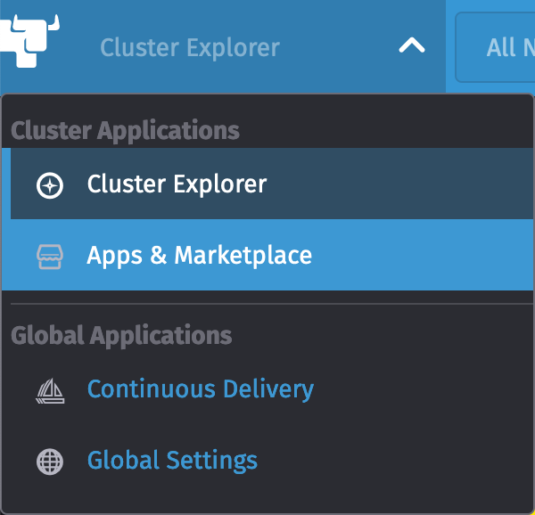
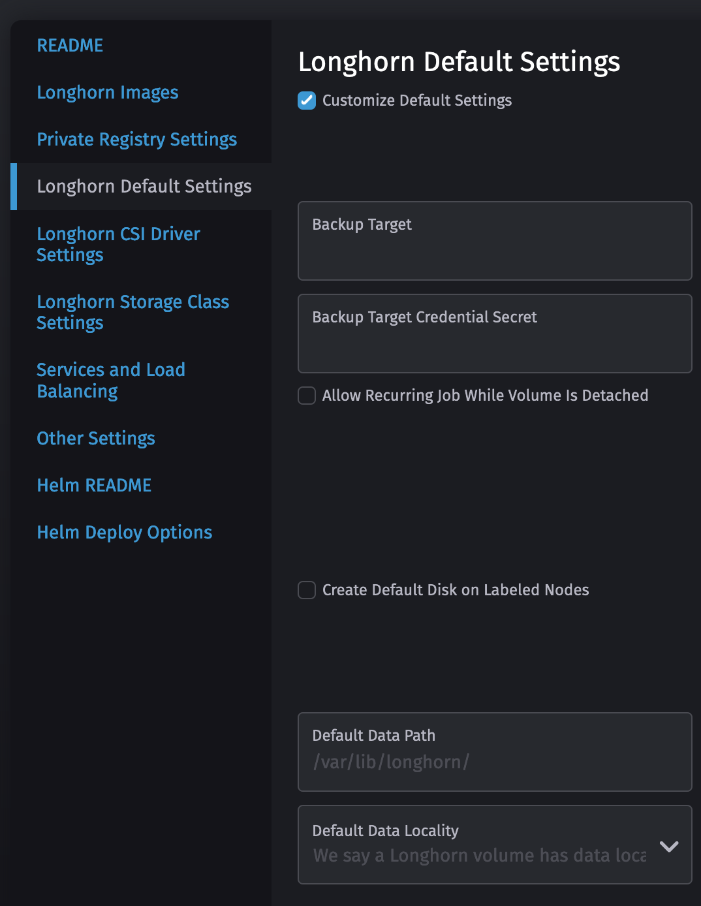
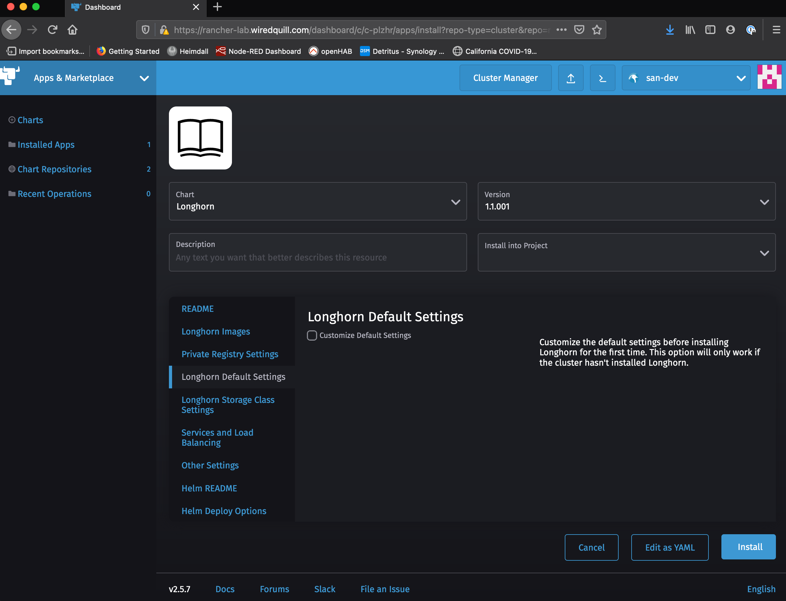
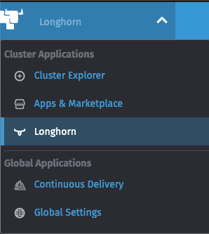
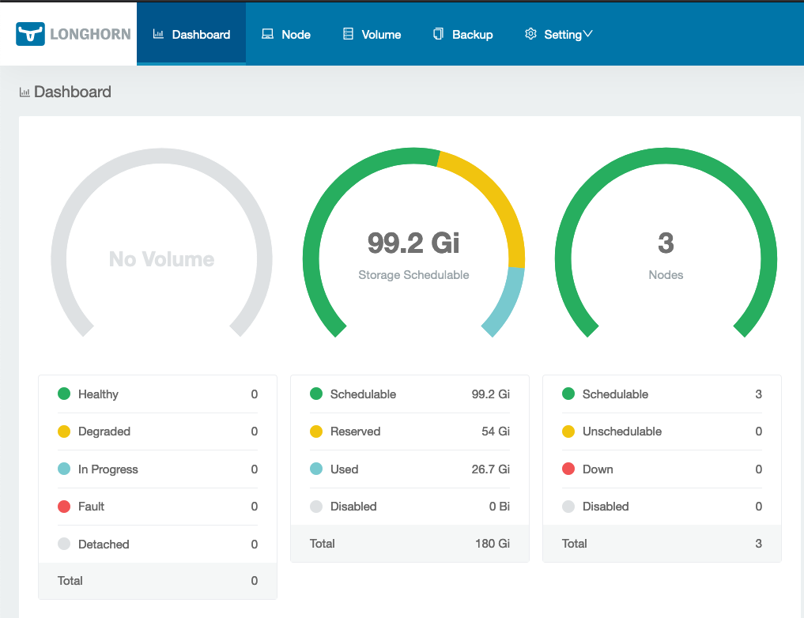
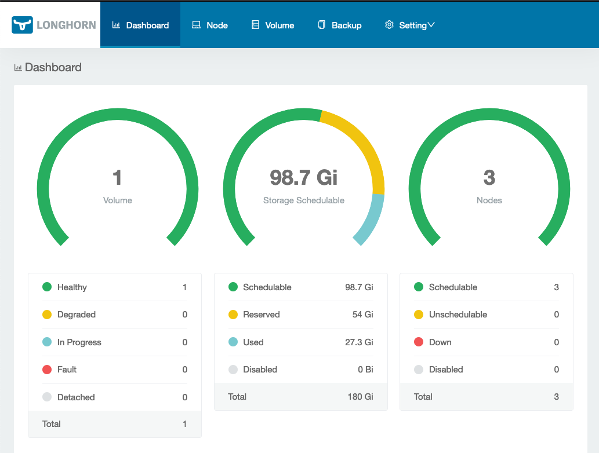

## Installing Longhorn 

### At the end of the Lab you will have:

- Longhorn installed and setup as the Default StorageClass for your Cluster

### Prerequisites:

- Rancher up and running
- Target Cluster that you want to install Longhorn into
    - Longhorn uses /var/lib/longhorn one the nodes of the Cluster to store data

### Installation of Lonnghorn
#### Step by Step Instructions
 
    From a browser, go to your Rancher Cluster Explorer and make sure you have the Target Cluster selected 


    Select Apps & Marketplace from the dropdown menu




    From the Charts Menu, select Longhorn


    *If you want to change the default path used by Longhorn click 'Customize Default Settings'



    Click install and you are Done!



### Lonnghorn Console

    Once Lognhorn is installed, you can access the console by simply Selecting it in the Upper Left hand Menu and Click on the Longhorn Icon to launch the console




    Notice in the console we don't have any Volumes yet




### Test Longhorn

```
Create a test-pvc.yml  

# test-pvc.yml 
apiVersion: v1
kind: PersistentVolumeClaim
metadata:
  name: test-pvc
spec:
  storageClassName:
  accessModes:
    - ReadWriteOnce
  resources:
    requests:
      storage: 5Gi

```

```
Create a test-deplyment.yml

# test-deplyment.yml
kind: Pod
apiVersion: v1
metadata:
  name: test-pvc-pod
spec:
  volumes:
  - name: debug-pv
    persistentVolumeClaim:
      claimName: test-pvc
  containers:
  - name: debugger
    image: busybox
    command: ["sleep", "3600"]
    volumeMounts:
    - mountPath: "/data"
      name: debug-pv
```


Deploy the PVC and the Deployment

```
    kubectl apply -f test-pvc
    kubectl apply -f test-deplyment.yml
```

Look at the Longhorn Dashboard - You now see a volume created


