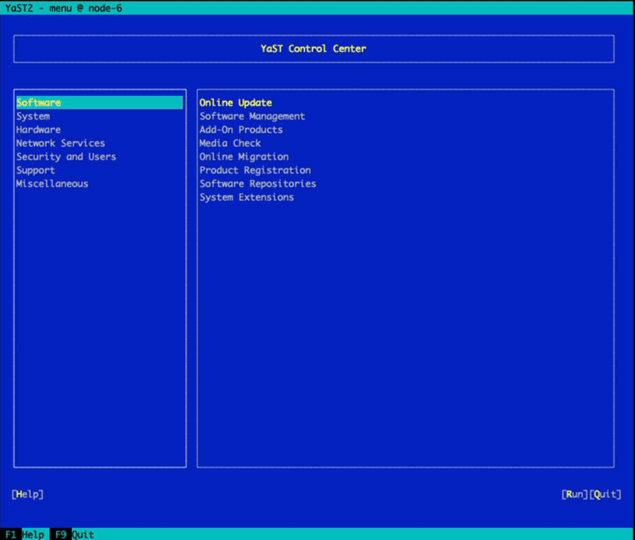
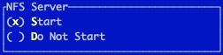
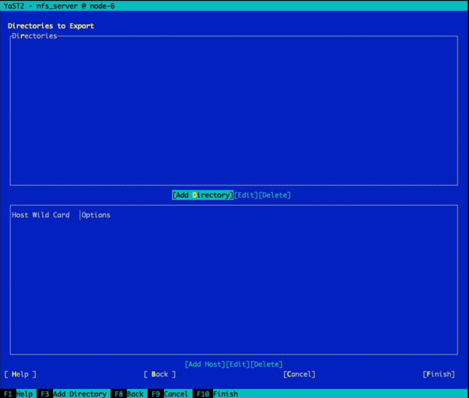
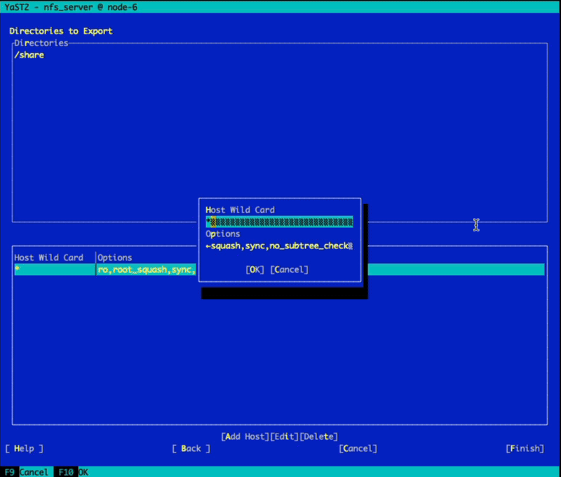

## Installing an NFS Server on SLES or Leap

### At the end of the Lab you will have:
* An NFS Server running on a SLES Server 


### Prerequisites:

NFS Server
  * Existing SLES 15 or Leap installed
  

# Install NFS Server


### 1) install yast2-nfs-server 
```
sudo zypper -n in yast2-nfs-server

```
### 2) Create folder to share and make accessible to anyone
```
sudo mkdir /share
sudo chmod 777 -R /share

```

### 3) Enable NFS share via Yast2
```
sudo yast2 yast2-nfs-server

```



### 4) Enable NFS Service
```
NFS Server - Start 

```



### 5) Add the Directory you want to share (/share)
```
Click [Add Directory]
add /share folder we created in the step above 
```



### 6) Customize Option to make it ReadWrite and no_root_squash
```
enter: rw,no_root_squash,sync,no_subtree_check 

```




### 7 Exit Yast2 and you are ready for NFS clients to 

