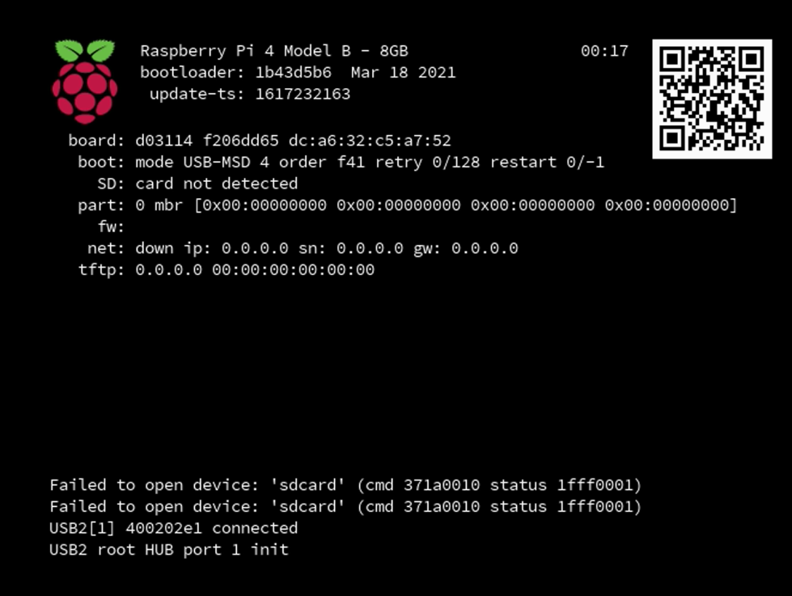

# Installing SLES 15 SP2 on Raspberry Pi - Supplement  - Booting from USB drive

This lab is a supplement to the install and configure SLES 15 SP2 on a Raspberry Pi. 

This lab details the additional steps need to boot SLE from a USB boot disk.

There are a couple of things we need to do to make SLE boot from USB.

* Update to the latest firmware (raspian)- reboot
* Set boot order (raspian) - reboot
* Burn SLES15-SP2-JeOS.aarch64-15.2-RaspberryPi-QU1.raw.xz to USB Drive
* Copy latest Firmware from github to SLE USB boot disk

 #  Update Raspberry Pi's Firmware (03192021)
** Don't skip this step - older firmware does not support booting from USB or updating Firmware from the USB

### 1) Download the Latest Raspian OS from ... and burn it to an SDcard.

https://www.raspberrypi.org/software/

### 2) Boot from the Raspberry Pi OS

You do not need to go through the full configuration wizard.

### 3) Apply the latest Firmware 

Go to a Terminal Prompt

    sudo raspi-config

    Select 6 Advanced Options-> A7 BootLoader Version
    Select E1 Latest and Accept

    Exit and reboot 

      ** don't skip this - The next option will not appear if you don't have a current firmware active.
      ** Reboot can take up to 3 mins to write EPROM

### 4) Set boot option in Firmware 

Go to a Terminal Prompt

    sudo raspi-config
    Select 6 Advanced Options-> A6 Boot Order
    Select B2 USB Boot

    Exit and Reboot.

###  Once the  Display goes blank the firmware has been update and you can power off and remove the SDcard

Power On the Pi and compare look at the boot screen. It shoud look simular to the screen below.

# Making the USB Boot Disk

### 1) Download the latest Raspberry Pi Firmware
Download https://github.com/raspberrypi/firmware

### 2) Burning the image to an USB disk

Burn this image to the USB Disk with the same method you used to burn the image to an SDCard.

### 3) Mount the EFI partition (if it was unmounted during the burn process)

### 4) update Firmware on USB disk

Copy the following files from /boot folder of the github project to root of your boot USB.

    start4.elf – The Pi 4 GPU firmware. Forms a matched pair with fixup4.dat
    fixup4.dat – Additional code for the Pi 4 GPU. Forms a matched pair with start4.elf

Eject the USB disk from your machine and plug it into the Raspberry Pi.

You are now ready to boot.
