# Installing SLES 15 SP2 on x86

### At the end of the Lab you will have:

- 2x SLES15 SP2 minimal install ready for RKE
- 8 GiB RAM (minimally)
- Bridge Networking to your local network with access to the internet
- 4 CPU
- 60 GiB /
- no /home partition
- tux user created and member of docker group
- Firewall Disabled
- Containers Module installed
- yast2, docker, sudo installed

# Download SLE 15 sp2 media


### 1) Obtain media and registration key from <a href="https://scc.suse.com/admin/products/1939">the SCC</a>

### 2) Select the 'Show Download Information" link

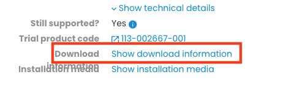

### 3) Then scroll down to the media you wish to use (Full or Online)
Be sure to choose the latest update (QU1 currently)

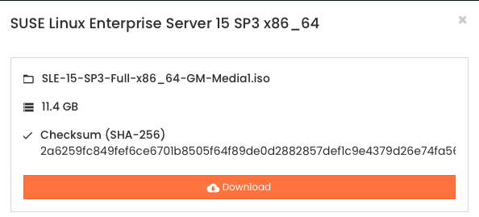

### 4) Copy your Registration code to the clipboard...if you don't see one...
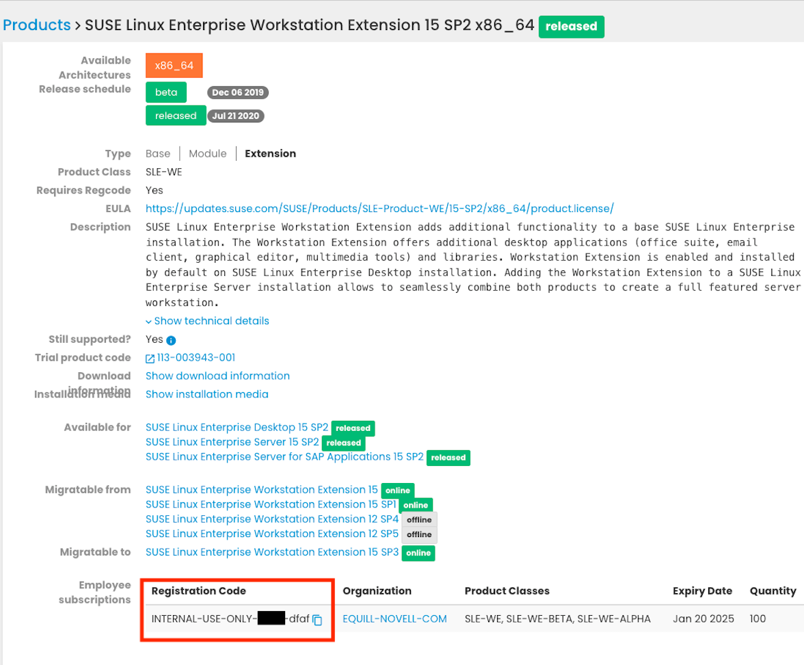

if you don't see a Registration Code...click the Generate Registration code link

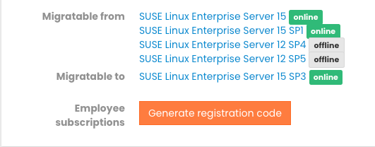

# Install SLES

### 1) Define a VM with the hardware described above

### 2) Boot off of iso

### 3) Select Install SUSE Linux Enterprise Server 15 SP2


### 4) Accept the License

### 5) Register the Server (Either with scc.suse.com or via a local rmt server)

Accept additional update repositories from the Registration Server

### 6) Select Containers Module 15 SP2 x86_64

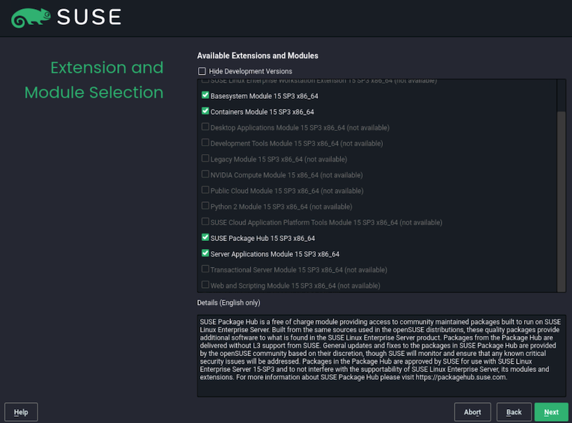

### 7) Skip selecting Add on Products

### 8) System Role - Select Minimal

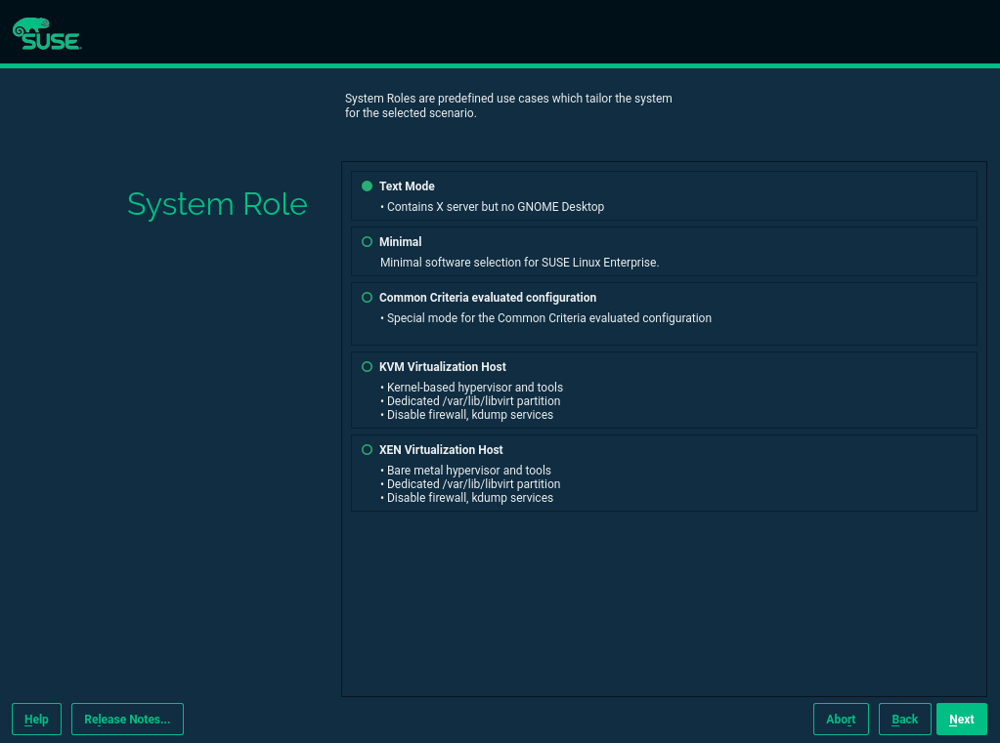

Partitioning -> Select Expert -> Start with Current Proposal

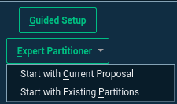

### 9) Partitioning screen is below

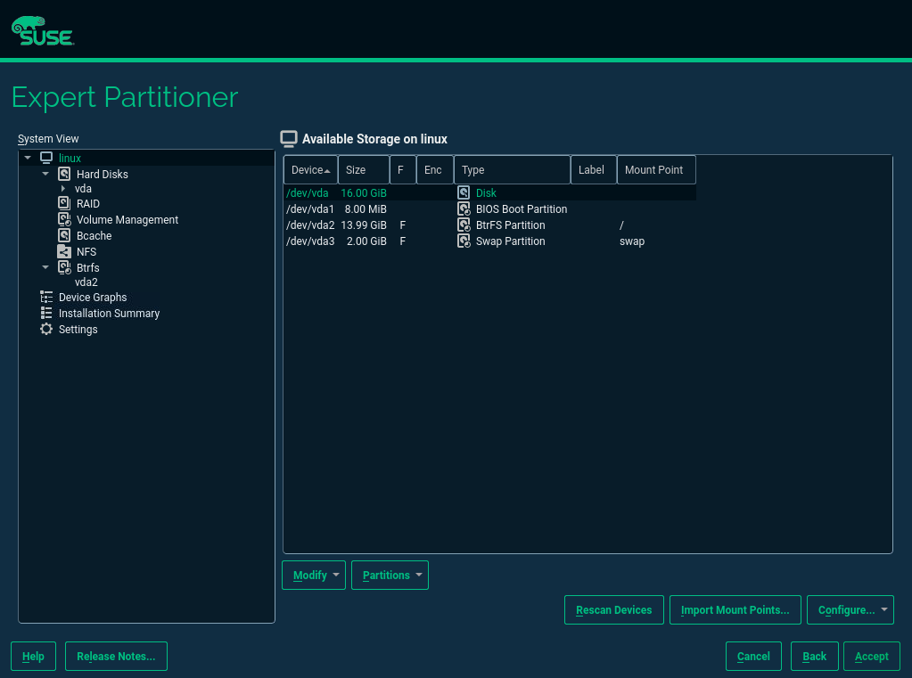

### 10) Resize / to take the rest of available space

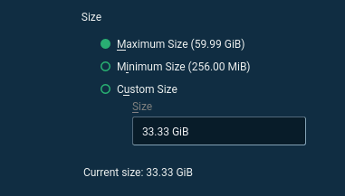

- Accept Partitioning
- Select your Timezone and Region
- Local User
- Create a User name tux
- assign a Password

### 11) Check the box for 'Use this password for the system administrator'

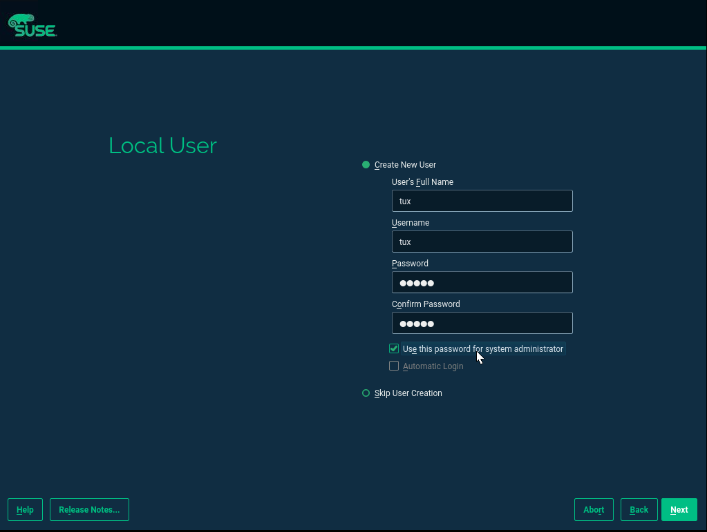

### 12) Installation Settings
- Disable Firewall under Security
- Disable Kdump

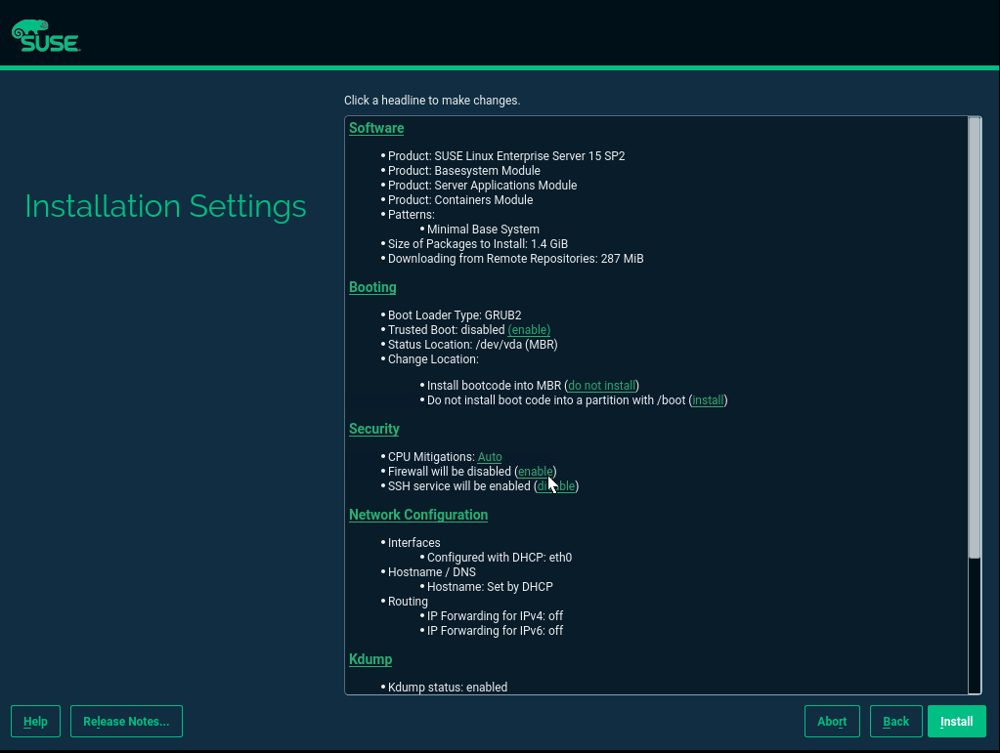

### 13) Finish Install by Clicking Install


# Post Install

### 1) connect as root or ssh as root to host
'''
ssh root@ipaddress
'''

### 2) Install yast2
```
zypper in -y -t pattern yast2_basis
```

### 3) Install additional software we will need to the Labs
```
zypper in -y sudo nmap docker wget iputils vim
```

### 4) Start and Test Docker service
```
systemctl enable --now docker.service

Example

     Created symlink /etc/systemd/system/multi-user.target.wants/docker.service → /usr/lib/systemd/system/docker.service.
```

### 5) Add tux user to the docker group so you can run docker without sudo
```
usermod -aG docker tux
```

### 6) Change the Hostname - Please use your name as part of the hostname
```
hostnamectl set-hostname rke-YOURNAME-1
```

### 7) Reboot the workstation and login as tux
```
reboot
```
### 8) Optional - Repeat these steps on a 2nd VM name rke-YOURNAME-2
