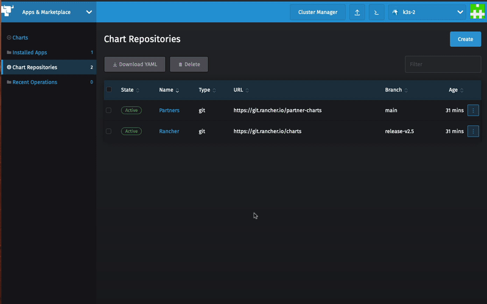
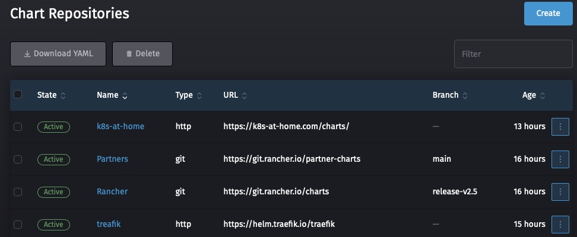
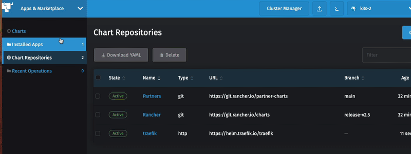
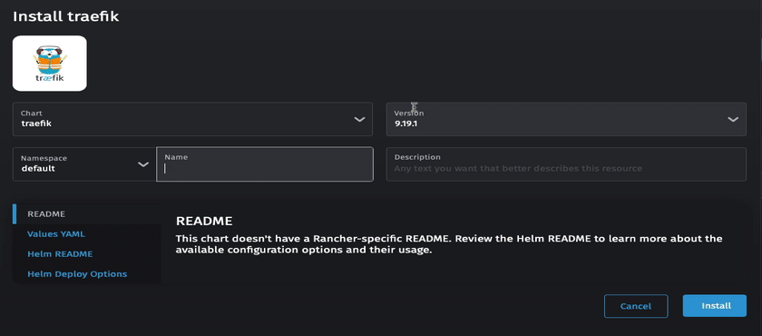
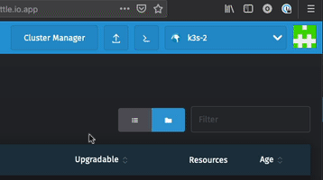
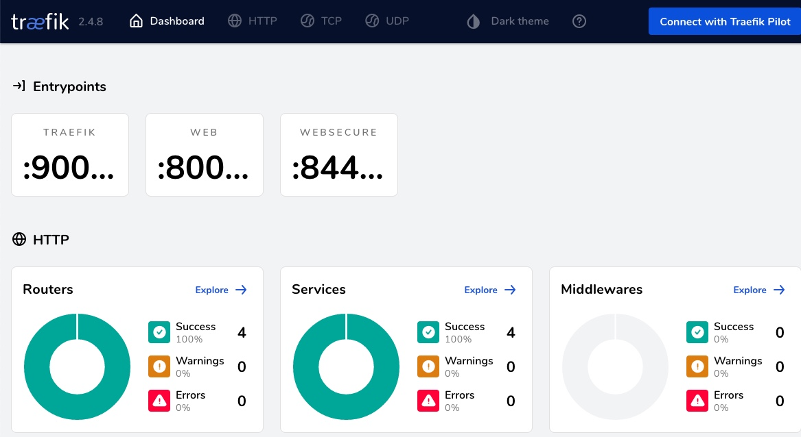
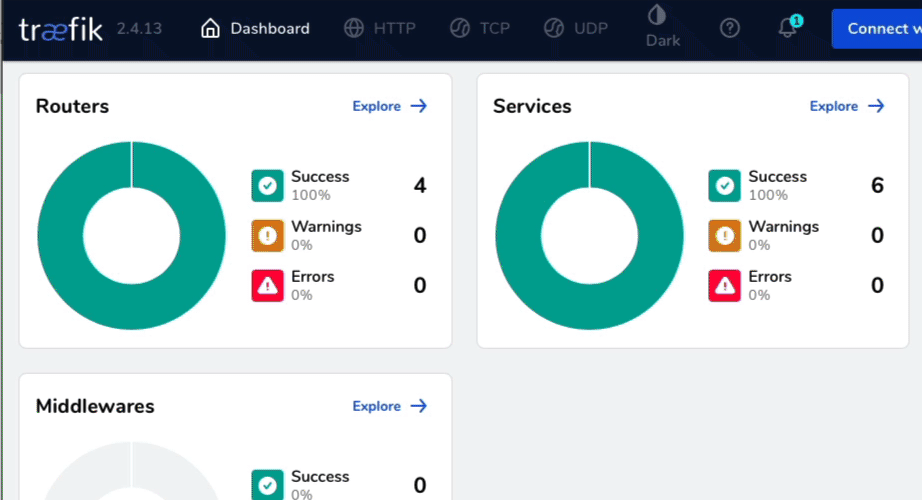
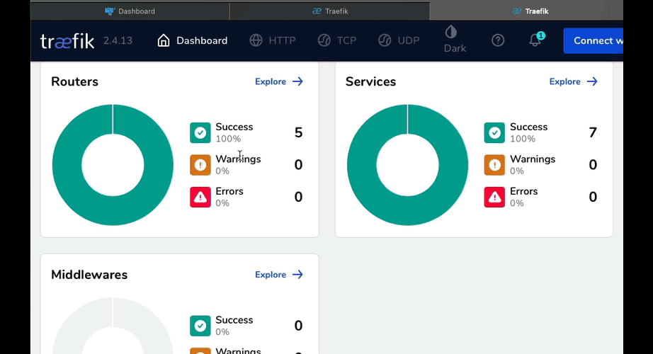

# Installing Traefik

In this Lab you will install and configure Traefik to help with incomming (ingress) requests 

### Prerequisites:

- Kubernetes Cluster (K3s in our Example)
    - Built in Traefik disabled
- Rancher
- MeatalLB installed and configured 


#  Add Traefik Repo

### 1) Create traefik Namespace


### 2) Select Charts Repo

    Select App & Marketplace -> Chart Repositories


### 3)    Click Create to define a new Chart Repository
    
    Name: Traefik
    Index url: https://helm.traefik.io/traefik
    


    You should see now see the Traefik Repo



#  Install Traefik

### 1) Select Traefik Chart

    Select Chart 
    
    You should now see the option to install traefik



### 2) Name Traefik
    
    Select the Namespace traefik
    Name the Deployment traefik 

### 3) Modifiy the Values YAML section to  
Enable ports->traefik->expose 

```
    ports:
      traefik:
        expose: true
        exposedPort: 9000
        port: 9000
        protocol: TCP
```


### 4) Deploy Traefik




#  Locate Traefik IP address

### 1) Access kubectl

    Access kubectl either Rancher interface (as shown) or from a terminal




### 2) Find traefik's IP address

    kubectl get svc -A


    This tells us Traefik is running on IP address 10.0.22.1

# Access Traefik Dashboard

### 1) Open a broswer to 10.0.22.1:9000/dashboard/




# Testing Traefik

## Traefik using a Host name

### 1) config and verify DNS entry for who.{yourdomain}.com is pointing to the IP Address of your Traefik Service
        In my example I have who.wiredquill.com at 10.0.22.1

### 2) Deploy whoami app using Trafik host name
```
kubectl apply -f whoami-deploy-host.yaml
```

Example
```
namespace/who2 created
deployment.apps/whoami created
service/whoami created
```

### 3) Deploy Ingres Route Rule for host

```
kubectl apply -f whoami-IngresRoute-host.yaml
```

Example
```
ingressroute.traefik.containo.us/whoami created
```

### 4) View the change in Routers in the Traefik Dashboard



### 5) Test whoami App

```
Open a browser to http://who.wiredquill.com
```

Example
```
Hostname: whoami-6fb5b5d74d-4ghdb
IP: 127.0.0.1
IP: ::1
IP: 10.42.0.12
IP: fe80::94ea:30ff:fead:3a82
RemoteAddr: 10.42.0.11:34586
GET / HTTP/1.1
Host: who.wiredquill.com
User-Agent: Mozilla/5.0 (Macintosh; Intel Mac OS X 10_15_7) AppleWebKit/605.1.15 (KHTML, like Gecko) Version/14.1.2 Safari/605.1.15
Accept: text/html,application/xhtml+xml,application/xml;q=0.9,*/*;q=0.8
Accept-Encoding: gzip, deflate
Accept-Language: en-us
Upgrade-Insecure-Requests: 1
X-Forwarded-For: 10.42.0.1
X-Forwarded-Host: who.wiredquill.com
X-Forwarded-Port: 80
X-Forwarded-Proto: http
X-Forwarded-Server: traefik-10-1628783659-7976cbf877-mxfqs
X-Real-Ip: 10.42.0.1
```

## Traefik using a Path


### 1) Deploy whoami app using Trafik host name
```
kubectl apply -f whoami-deploy-path.yaml
```

Example
```
namespace/who3 created
deployment.apps/whoami created
service/whoami created
```

### 2) Deploy Ingres Route Rule for host

```
kubectl apply -f whoami-IngresRoute-path.yaml
```

Example
```
ingressroute.traefik.containo.us/whoami created
```

### 3) View the change in Routers in the Traefik Dashboard



### 5) Test whoami App

```
Open a browser to the IP Addess of you Traefik service http://10.0.22.1/who
```

Example
```
Hostname: whoami-6fb5b5d74d-hcrhc
IP: 127.0.0.1
IP: ::1
IP: 10.42.0.13
IP: fe80::843e:58ff:fe0c:a720
RemoteAddr: 10.42.0.11:51434
GET /who HTTP/1.1
Host: 10.0.23.100
User-Agent: Mozilla/5.0 (Macintosh; Intel Mac OS X 10_15_7) AppleWebKit/605.1.15 (KHTML, like Gecko) Version/14.1.2 Safari/605.1.15
Accept: text/html,application/xhtml+xml,application/xml;q=0.9,*/*;q=0.8
Accept-Encoding: gzip, deflate
Accept-Language: en-us
Upgrade-Insecure-Requests: 1
X-Forwarded-For: 10.42.0.1
X-Forwarded-Host: 10.0.23.100
X-Forwarded-Port: 80
X-Forwarded-Proto: http
X-Forwarded-Server: traefik-10-1628783659-7976cbf877-mxfqs
X-Real-Ip: 10.42.0.1
```